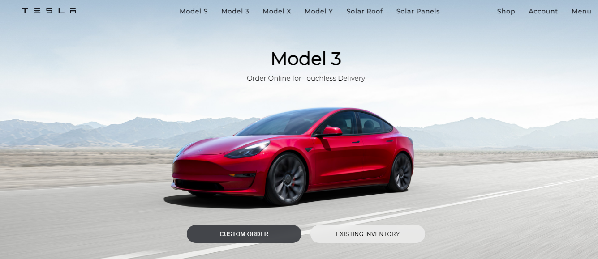

<h1 align="center">Tesla Clone 🚗</h1>

<p align="center">
<a href="https://github.com/kumartul/tesla-clone/fork" target="blank">

</a>
<a href="https://github.com/kumartul/tesla-clone/stargazers" target="blank">

</a>
<a href="https://github.com/kumartul/tesla-clone/issues" target="blank">

</a>
<a href="https://github.com/kumartul/tesla-clone/pulls" target="blank">

</a>
<a href="https://twitter.com/intent/tweet?text=Checkout tesla-clone-kumartul.vercel.app by @kumartul001
Source Code: github.com/kumartul/tesla-clone"></a>

</p>

<p align="center"></p>

<p align="center">
    <a href="https://tesla-clone-kumartul.vercel.app/" target="blank">View</a>
    ·
    <a href="https://github.com/kumartul/tesla-clone/issues/new/choose">Report Bug</a>
    ·
    <a href="https://github.com/kumartul/tesla-clone/issues/new/choose">Request Feature</a>
</p>

### Introducing Tesla Clone 👋

Tesla Clone is simply a clone of [Original Tesla](https://tesla.com). Check out [Tesla Clone](https://tesla-clone-kumartul.vercel.app/) 🙌

## 🚀 Check it out

<a href="https://tesla-clone-kumartul.vercel.app/" target="blank">
    
</a>

Try the App: [tesla-clone-kumartul.vercel.app](https://tesla-clone-kumartul.vercel.app/)

## 🛠️ Installation Steps

1. Clone the repository

```bash
git clone https://github.com/kumartul/tesla-clone.git
```

2. Change the working directory

```bash
cd tesla-clone
```

3. Install dependencies

```bash
npm install
```

4. Run the app

```bash
npm run start
```

You are ready to build! Open [localhost:3000](http://localhost:3000/) to see the app.

## 🍰 Contributing

- Please contribute using [GitHub Flow](https://guides.github.com/introduction/flow). Create a branch, add commits, and [open a pull request](https://github.com/kumartul/tesla-clone/compare).

## 💻 Built with

- [HTML](https://html.spec.whatwg.org/)
- [CSS](https://www.w3.org/Style/CSS/specs.en.html)
- [JavaScript](https://www.ecma-international.org/publications-and-standards/standards/ecma-262/)
- [React](https://reactjs.org/)
- [Redux](https://redux.js.org/): For managing states
- [Firebase](https://firebase.google.com/): As backend
- [react-router-dom](https://v5.reactrouter.com/web/guides/quick-start): For Routing

## 👨‍💻 Author

### 👤 Atul Kumar

- Email: [kumartul001@gmail.com](kumartul001@gmail.com)
- Github: [kumartul](https://github.com/kumartul)
- Twitter: [kumartul001](https://twitter.com/kumartul001)
- Instagram: [kumartul001](https://instagram.com/kumartul001)
- Facebook: [kumartul001](https://facebook.com/kumartul001)
- Hashnode: [kumartul](https://hashnode.com/@kumartul)
- Medium: [kumartul001](https://hashnode.com/@kumartul001)
- ProductHunt: [@kumartul001](https://www.producthunt.com/@kumartul001)
- Devpost: [kumartul](https://devpost.com/kumartul)
- HackerEarth: [@kumartul001](https://www.hackerearth.com/@kumartul001)
- Fueler: [kumartul](https://fueler.io/kumartul)
- IndieHackers: [kumartul](https://www.indiehackers.com/kumartul)
- Dev: [kumartul001](https://dev.to/kumartul001)
- BuyMeACoffee: [kumartul](https://www.buymeacoffee.com/kumartul)
- Tiny Acquisitions: [atulkumar](https://tinyacquisitions.com/profile/atulkumar)

## 🙏 Support

This project needs a ⭐️ from you. Don't forget to leave a star ⭐️

If you found this clone helpful, consider supporting me with a coffee.

<a href="https://www.buymeacoffee.com/kumartul">
    
</a>

---

<h3 align="center">
    Tesla Clone needs a ⭐️ from you
</h3>